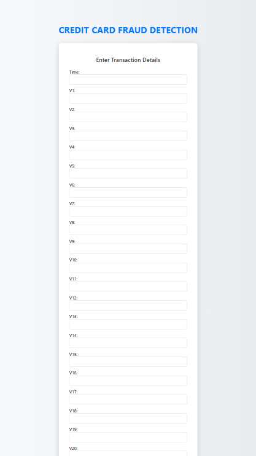

# Credit Card Fraud Detection

## Description
This project is a web application built with **Flask** that predicts whether a credit card transaction is **fraudulent** or **legitimate** using a trained **machine learning model**. It leverages **scikit-learn**, **pandas**, and **numpy** to handle data and make predictions in real-time.

The app provides a simple web interface where users can input transaction features and receive an immediate prediction.

---

## Features
- Predicts fraudulent vs legitimate credit card transactions.
- User-friendly web interface built with Flask.
- Uses a pre-trained Logistic Regression model.
- Supports real-time prediction with user inputs.
- Lightweight and easy to deploy.

---

## Installation & Setup
1. **Clone the repository**
 ```bash
git clone https://github.com/yourusername/credit-card-fraud-detection.git
cd credit-card-fraud-detection
```
2. **Create a virtual environment (recommended)**
```bash
python -m venv venv
```
3. **Activate the virtual environment**
```bash
Windows:

venv\Scripts\activate


Mac/Linux:

source venv/bin/activate
```

4. **Install dependencies**
```bash
pip install -r requirements.txt

```
5. **Run the Flask app**
```bash
python app.py
```

6. **Open in browser**
```bash
Go to http://127.0.0.1:5000
 to access the application.
```
8. **Example Input/Output**
```bash
Input:

Time: 10000  
V1: -1.3598071336738  
V2: -0.0727811733098497  
V3: 2.53634673796914  
... (and so on for V4 to V28)  
Amount: 149.62


Output:

Prediction: Fraudulent Transaction


or

Prediction: Legitimate Transaction



```
